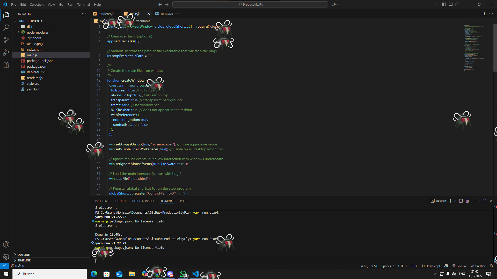

ProductivityFly
The anti-procrastination app that'll bug you!

ProductivityFly is a fun (and slightly annoying) desktop application designed to help you stop procrastinating. It displays animated flies on your screen that multiply automatically every 3 minutes, creating a visual, growing incentive to start and finish the task you've been avoiding.

The flies only stop and the application closes when you run a designated "stop" executable or press a configured keyboard shortcut. It's perfect for coding, studying, or any task requiring deep focus. 😎

✨ Key Features
Feature Description
Technology Stack Built with Electron for cross-platform desktop compatibility, and Canvas + JavaScript for efficient fly animations.
Automatic Multiplier Flies multiply every 3 minutes, increasing visual urgency.
Always On Top Uses a transparent window with the alwaysOnTop property to ensure the flies remain over every application.
Random Movement Flies move randomly across the entire screen.
Flexible Stopping Stop the annoyance via a configurable keyboard shortcut (default: Ctrl+Shift+X) or by running a designated executable (ideal for integrating into your workflow).
Cross-Platform Works on Windows, macOS, and Linux.
Universal Use Can be used for any task you are procrastinating on, not just coding.

Exportar a Hojas de cálculo
💻 Installation and Setup
🛠️ Prerequisites
Make sure you have the following installed:

Node.js (version 18+ recommended)

npm (version 9+ recommended)

🚀 Getting Started

1. Clone the repository:

Bash

git clone https://github.com/your-username/ProductivityFly.git
cd ProductivityFly

2. Install dependencies:

Bash

npm install

3. Run the application in development mode:

Bash

npm start
📋 Usage
Upon first startup, you will be prompted to select a stop executable. This can be a simple script, a program, or an action (like a Git commit script) that signifies task completion.

The fly window will appear, remaining transparent and always on top of your desktop.

Start your task. Remember, the flies will multiply every 3 minutes!

To stop the flies:

Press the keyboard shortcut (Ctrl+Shift+X by default).

Run the selected "stop" executable from within the app or via your automated workflow.

⚠️ Important Note: The stop executable must be triggered in a way that the application detects the event. Manually launching the file may not stop the flies if it's not correctly integrated with the app's event listeners.

📁 Project Structure
Bash

ProductivityFly/
│
├─ main.js # Electron main process (window/app handling)
├─ renderer.js # Canvas/JavaScript logic for animation and fly management
├─ index.html # Canvas interface
├─ package.json # Project configuration and scripts
├─ assets/ # Sprites and icons
└─ README.md # Documentation

⚙️ Available Scripts
npm start: Runs the application in development mode.
npm run package: Builds a standalone executable for your operating system using electron-builder. This command generates the final program file.

🛑 Notes and Warnings
Antivirus: Due to the use of alwaysOnTop and transparent windows (common for overlays), the application may trigger warnings in some antivirus programs. The code is safe, but test in a secure environment before distribution.

Code Signing: The current version does not include code signing. If you plan to distribute it, consider signing the code to avoid security alerts on operating systems.

📄 License and Credits
This project is intended for personal and educational use only. Distribution without developer consent is not recommended.

Developed by [Your Name].

Inspired by the idea of gamifying productivity and turning procrastination into action using annoying little flies. 🐞

Sprite Credit:

Fly Sprite used under license from Elthen.

